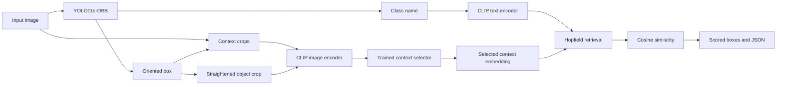

# Inference flow

```mermaid
flowchart LR
    A[Input image] --> B[YOLO11s-OBB]
    B --> C[Class name]
    B --> D[Oriented box]
    A --> E[Context crops]
    D --> E
    D --> F[Straightened object crop]
    E --> G[CLIP image encoder]
    F --> G
    G --> H[Trained context selector]
    H --> I[Selected context embedding]
    C --> J[CLIP text encoder]
    J --> K[Hopfield retrieval]
    I --> K
    K --> L[Cosine similarity]
    L --> M[Scored boxes and JSON]
```

For one detection, the full image supplies the context directly.
